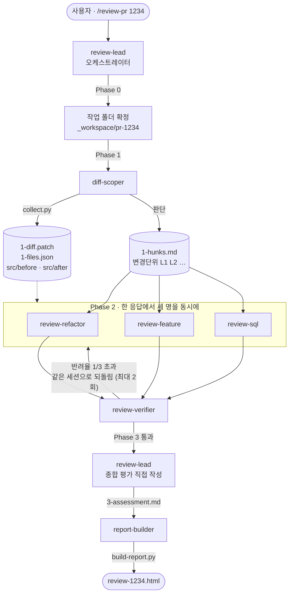

# 이 하네스는 어떻게 동작하는가

> PR 하나를 **세 관점이 동시에** 리뷰하고, 지적을 **검증으로 걸러낸 뒤**,
> 팀이 모여 보는 **단일 HTML 파일**을 만듭니다.

처음 쓰는 분과, 이 구조를 남에게 설명해야 하는 분을 위한 문서입니다.
바로 실행하는 방법만 필요하면 [../README.md](../README.md) 를 보세요.

---

## 1. 한 장 요약

| | |
|---|---|
| **입력** | PR 번호 하나 (`/review-pr 1234`) |
| **출력** | `_workspace/pr-1234/review-1234.html` — 브라우저로 여는 파일 |
| **관점** | 리팩토링 · 기능 · SQL |
| **참여자** | 오케스트레이터 1 + 서브에이전트 6 |
| **필요한 것** | Python 3.8+ · gh CLI · git |
| **네트워크** | 리포트는 외부 요청 0건. 폐쇄망에서 그냥 열립니다 |

한 문장으로: **"리뷰 결과를 채팅이 아니라 회의 자료로 내놓는다."**

---

## 2. 왜 이렇게 만들었나

원래는 SKILL.md 한 장이었습니다. "이런 순서로 리뷰해 줘"라고 부탁하는 문서였고,
세 가지가 부족했습니다. **이 세 가지가 이 하네스 설계의 전부**입니다.

| 문제 | 무엇이 일어났나 | 어떻게 풀었나 |
|---|---|---|
| **한 명이 전부 본다** | 리팩토링·기능·SQL 을 한 세션이 순차로 보면 뒤로 갈수록 앞을 잊습니다 | 관점별로 **에이전트를 나누고 동시에** 띄웁니다 (팬아웃-팬인) |
| **지적의 근거가 검증되지 않는다** | 안 바뀐 코드를 신규로 오인하거나, 인용한 코드가 실제와 다릅니다 | **검증관**이 지적을 원문과 대조해 반려합니다 (생성-검증) |
| **산출물이 채팅 스크롤이다** | 팀원이 모여 보려면 결과가 파일이어야 합니다 | **단일 HTML** 을 스크립트가 생성합니다 |

> 발표에서 이 표 하나만 있어도 "왜 이렇게 복잡하냐"는 질문의 답이 됩니다.

---

## 3. 전체 흐름



Phase 사이는 **파일로** 잇습니다. 에이전트끼리는 서로의 대화를 볼 수 없기 때문입니다.

| Phase | 담당 | 읽는 것 | 남기는 것 |
|---|---|---|---|
| 0 준비 | `review-lead` | `_workspace/` | 작업 폴더 결정 |
| 1 수집 | `diff-scoper` | PR (gh·git) | `1-*.{patch,json,md}` · `src/` |
| 2 리뷰 | 리뷰어 3인 | `1-hunks.md` · `src/` | `2-review-*.md` |
| 3 검증 | `review-verifier` | `1-*` · `2-*` | `3-verify.md` |
| 3.5 평가 | `review-lead` (직접) | 위 전부 | `3-assessment.md` |
| 4 리포트 | `report-builder` | `1-*` · `2-*` · `3-*` | `4-findings.json` → **HTML** |

---

## 4. Phase 별로 무슨 일이 일어나나

### Phase 0 — 작업 폴더 확정

오케스트레이터가 가장 먼저 하는 일은 **어디에 쓸지 정하는 것**입니다.

```
_workspace/pr-1234/     ← 이번 리뷰가 쓰는 곳
_workspace/pr-5678/     ← 다른 사람이 동시에 쓰고 있을 수 있음
```

PR 번호로 폴더를 나누므로 **두 PR 을 동시에 리뷰해도 섞이지 않습니다.**
이미 폴더가 있으면 이어서 할지 물어보고, 새로 시작하면 `collect.py` 가
`pr-1234.prev-20260907-1403` 으로 **밀어냅니다. 지우지 않습니다.**

### Phase 1 — 수집과 변경단위 확정

두 가지 일이 있고, 성격이 다릅니다.

**기계적인 것 — `collect.py` 가 합니다**

```bash
python .opencode/skills/code-review-oi-pr/assets/collect.py --pr 1234 --ws _workspace/pr-1234
```

`gh pr diff` 로 패치를 받고, `git fetch` + `git show` 로 변경 파일의 before/after 원문을
내려받습니다. **체크아웃하지 않습니다** — 작업 트리를 건드리지 않습니다.
패치에서 파일별 상태(`added`/`modified`/`renamed`/`moved`/`deleted`)와
SQL 변경 여부, 우선순위까지 뽑아 `1-files.json` 으로 냅니다.

**판단이 필요한 것 — `diff-scoper` 가 합니다**

파일 안을 **논리적 변경단위**로 쪼개고 `L1`, `L2` … 번호를 붙입니다.

| ID | 파일 | 유형 | after 라인 | 요약 |
|---|---|---|---|---|
| L5 | YOEDSMOV.xaml.cs | 변경 | 82–126 | Confirm() 단건 → 다건 반복 확정으로 전면 변경 |
| L6 | YOEDSMOV.xaml.cs | 신규 | 127–139 | 반출 가능 상태 검사 함수 추가 |

헝크 하나가 곧 변경단위는 아닙니다. 한 함수가 통째로 바뀌었으면 헝크가 여럿이어도 **하나**입니다.

> **여기가 이 하네스에서 가장 파급이 큰 자리입니다.** 이 표가 틀리면 뒤의 세 명이
> 전부 틀린 것을 봅니다. 그래서 `diff-scoper` 에만 예외적으로 고가 모델을 씁니다.
> 실 PR 에 처음 적용할 때 `/scope-only 1234` 로 이 단계만 먼저 확인하길 권하는 이유이기도 합니다.

### Phase 2 — 3인 동시 리뷰 (팬아웃)

오케스트레이터가 **한 번의 응답 안에서 세 개의 `task` 를 모두 호출**합니다.
하나씩 기다렸다 부르면 팬아웃이 아니고, 시간이 3배가 됩니다.

| 리뷰어 | 보는 것 | 기준 문서 |
|---|---|---|
| `review-refactor` | 함수명·VO명·변수·상수·`this`·테스트 명명 | `naming-rules.md` |
| `review-feature` | 로직·경계·예외 경로·Manager 사용 규범 | `manager-patterns.md` |
| `review-sql` | 쿼리 본문·바인딩·인덱스·튜닝 | `read-sql.md` |

세 프롬프트는 **작업 폴더와 산출물 파일명만 다릅니다.** "SQL 을 봐라" 같은 지시를 붙이지 않습니다.
관점은 각 에이전트의 시스템 프롬프트에 이미 박혀 있어서, 리뷰어를 하나 늘려도
오케스트레이터는 거의 안 고쳐도 됩니다.

각 에이전트에는 **`## 당신이 보지 않는 것`** 절이 있습니다. 팬아웃이 실패하는 흔한 방식이
**전원이 같은 말을 하는 것**이기 때문입니다. 셋을 띄웠는데 셋 다 "이름이 이상하다"고 하면
한 명 띄운 것과 다를 게 없습니다.

### Phase 3 — 지적 검증 (생성-검증)

`review-verifier` 가 지적을 **하나씩** 원문·패치·규칙 문서와 대조합니다.

| 검사 | 통과 못 하면 |
|---|---|
| **V-1** 인용한 라인이 변경단위 **안**에 있는가 | `REJECTED` — 안 바뀐 기존 코드 지적 |
| **V-2** 인용 코드가 `src/after/` 원문과 **글자 그대로** 같은가 | `REJECTED` — 존재하지 않는 코드 |
| **V-3** 근거로 든 규칙 번호가 참조 문서에 **실재**하는가 | `REJECTED` — 지어낸 규칙 |
| **V-4** BLOCKER 인데 "그래서 무슨 일이 생기는지"가 있는가 | **MAJOR 로 강등** (반려 아님) |

여기에 중복 지적과 관점 침범도 걸러냅니다.
한 리뷰어의 반려율이 **1/3 을 넘으면** 그 리뷰어 **세션으로 되돌려** 다시 쓰게 합니다
(새 리뷰어를 부르지 않습니다 — 그 사람은 자기가 무엇을 봤는지 기억합니다). **최대 2회.**

**반려된 지적은 지우지 않습니다.** HTML 맨 아래 접이식 절에 사유와 함께 남습니다.
팀원이 "왜 이건 안 잡혔지"를 확인할 수 있어야 하기 때문입니다.

> 이 단계가 있는 이유는 하나입니다. **틀린 지적 한 건이 회의 30분을 잡아먹기 때문**입니다.
> "이거 원래 그랬는데요"가 나오면 그 자리에 있는 사람 수만큼 시간이 곱해집니다.

### Phase 3.5 — 종합 평가 (오케스트레이터가 직접)

검증까지 끝나면 **전체를 본 사람은 오케스트레이터뿐**입니다. 그래서 이 글만은 위임하지 않고
직접 `3-assessment.md` 에 씁니다.

| 절 | 내용 |
|---|---|
| 최종 의견 | 병합 가부 → 가장 큰 문제 → 전체 인상. 3~5줄 |
| 재확인 필요사항 | 회의에서 **사람이 결정해야** 하는 것 |
| 회의 진행 순서 | 지적 ID 를 볼 순서대로 — 리포트에서 클릭 가능한 칩이 됩니다 |
| 잘된 점 | 선택. PR 전체 수준에서 |

원래 스킬의 `3. 종합 평가 (재확인 필요사항 · 최종 의견)` 자리입니다.
예전에는 이 내용이 채팅에만 남아 **회의실에서는 아무도 못 봤습니다.**

### Phase 4 — 리포트

`report-builder` 가 만드는 것은 **`4-findings.json` 하나**입니다. HTML 은 손대지 않습니다.

```
1-diff.patch    ─┐
src/after/…     ─┼→ build-report.py → 라인별 add/del 계산 → HTML
4-findings.json ─┘   (지적 내용 + 좌표만)
```

스크립트는 스키마를 **검증**하고 어긋나면 무엇이 틀렸는지 출력하며 exit 1 합니다.

```
✗ findings.json 검증 실패 — 2건
  · findings[3] (F004): unitId "L99" 가 units 에 없습니다
  · sql[0]: 필수 항목 "body" 이 없습니다
```

---

## 5. 설계 결정 여섯 가지

발표에서 가장 쓸모 있는 부분입니다. 각각 **문제 → 장치 → 효과** 순서입니다.

### ① 변경단위 ID 가 팬인의 접합면이다

세 리뷰어가 각자 "SqlManager.cs 61번째 줄 근처"라고 부르면 취합할 수 없습니다.
그래서 Phase 1 에서 좌표(`L1`, `L2` …)를 먼저 확정하고, **셋 다 그 ID 로만** 지적합니다.

> 04 샘플이 **형식**을 맞췄다면, 여기서는 **좌표까지** 맞춥니다.

### ② 부탁이던 규칙이 장치가 됐다

원래 스킬에는 이런 문장이 있었습니다.

> 기존 기능(변경이 없는 코드)은 리뷰하지 않는다.
> 변경 전의 코드를 신규 기능으로 오인하지 않는다.

문장만 있으면 모델은 급할 때 무시합니다. 지금은 세 곳에 걸려 있습니다.

1. `1-hunks.md` 의 **변경 유형 칸** — 리네이밍·이동·삭제를 Phase 1 에서 못 박습니다
2. 리뷰어 프롬프트 — "표에 없는 라인은 리뷰 대상이 아닙니다"
3. **검증관의 V-1** — 변경단위 밖 라인을 인용하면 반려

3번이 핵심입니다. **지키라고 부탁하는 대신, 안 지키면 걸러냅니다.**

### ③ LLM 이 코드를 옮겨 적지 않는다

리뷰 코멘트를 LLM 이 쓰는 건 당연합니다. 하지만 **코드를 옮겨 적게 하면 반드시 뭉개집니다.**
그래서 `findings.json` 에는 지적 내용과 **좌표만** 담고, 실제 코드와 diff 색칠은
스크립트가 원문에서 잘라 계산합니다.

### ④ 리포트가 요약부터 보여준다

코드 순서대로 늘어놓으면 "뭘 봐야 하는지" 알려고 전부 읽어야 합니다. 그래서 페이지 맨 위가
**리뷰 체크리스트**(지적 전체를 심각도 순 한 줄씩)와 **변경 요약**(단위별로 뭐가 바뀌었나)이고,
코드 블록은 **기본으로 접혀** 있습니다.

그래서 `findings[].title` 과 `units[].summary` 를 **한 줄로 읽히게 쓰는 것**이 중요합니다.
요약이 부실하면 이 구조가 무너집니다.

### ⑤ 권한으로 역할을 못 박았다

프롬프트에 "고치지 마세요"라고 쓰기만 하면 모델이 급할 때 무시합니다.

```jsonc
// opencode.jsonc — 전역 기본값부터
"permission": { "edit": "deny", "bash": "ask" }
```

각 에이전트는 `*_workspace/*` 만 열려 있어 **자기 보고서만** 씁니다.
**이 하네스에서는 아무도 소스를 못 고칩니다.** 리뷰 전용이기 때문입니다.

bash 도 역할별로 최소한만 엽니다.

| 에이전트 | 열린 명령 |
|---|---|
| `diff-scoper` | `python` · `gh pr view` · `git log` · `git rev-parse` |
| `report-builder` | `python` |
| `review-lead` | `git status` · `git rev-parse` |
| 리뷰어 3인 | `git show` · `git diff` · `git log` |
| `review-sql` | 위 + 검색기 (`rg`·`findstr`·`Select-String`·`grep`) |

`review-sql` 만 검색기가 열린 이유는 **DPImgr 가 저장소 밖**이라 `grep`/`glob` 도구가 닿지 않기 때문입니다.

### ⑥ 셸에 의존하지 않는다

팀 환경은 Windows/PowerShell 인데, Unix 셸 문법은 여기서 통하지 않습니다.

| Unix | PowerShell |
|---|---|
| `ls -la` · `mkdir -p` · `rm -rf` · `wc` · `basename` | **오류** |
| `명령 > 파일` | PowerShell 5.1 은 **UTF-16LE** 로 씁니다 |

마지막 줄이 가장 위험합니다. **오류가 나지 않습니다.** 패치가 깨진 채 리포트가 만들어지고
아무도 모릅니다. 그래서 수집을 `collect.py` 로 옮겨 gh/git 을 직접 부르고 출력을
**바이트 그대로** 씁니다. 파일 목록 확인 같은 것은 셸 대신 `list`·`read` 도구를 씁니다.

`build-report.py` 는 읽는 파일이 UTF-16 이면 **감지해서 디코딩하고 경고**합니다.

---

## 6. 무엇이 남나

```
_workspace/
├── README.md                    규약 (유일하게 커밋되는 파일)
└── pr-1234/
    ├── STATUS.md                진행판 — 오케스트레이터만 갱신
    ├── 1-diff.patch             gh pr diff 원본 (UTF-8)
    ├── 1-meta.json              PR 번호·제목·작성자·base/head
    ├── 1-files.json             파일별 상태·헝크·증감·SQL 여부·우선순위
    ├── 1-scope.md               파일 목록 (사람이 읽는 형태)
    ├── 1-hunks.md               ★ 변경단위 표 — 세 리뷰어가 공유하는 좌표
    ├── src/after/…  src/before/…  변경 파일 원문
    ├── 2-review-refactor.md     리팩토링 지적 (R###)
    ├── 2-review-feature.md      기능 지적 (F###)
    ├── 2-review-sql.md          SQL 지적 (S###) + SQL 본문 (Q###)
    ├── 3-verify.md              지적별 CONFIRMED / NEEDS-INFO / REJECTED
    ├── 3-assessment.md          종합 평가 — 오케스트레이터가 직접 씀
    ├── 4-findings.json          HTML 입력 (스키마 고정)
    └── review-1234.html         ★ 회의에서 여는 파일
```

파일로 남기는 데는 네 가지 이득이 있습니다.

| | |
|---|---|
| **컨텍스트 절약** | 패치 전문을 프롬프트에 붙이는 대신 경로 한 줄만 넘깁니다 |
| **감사 흔적** | 반려된 지적까지 남아 회의에서 확인됩니다 |
| **재개 가능** | 끊겨도 `/status` 로 어디까지 갔는지 보고 이어갑니다 |
| **병렬 안전** | PR 별로 폴더가 갈리고, 한 폴더 안에서도 셋이 각자 다른 파일에 씁니다 |

---

## 7. HTML 리포트 — 회의에서 하는 일

`review-1234.html` 하나면 됩니다. **외부 요청 0건**이라 폐쇄망에서 그냥 열립니다.

| 순서 | 무엇 |
|---|---|
| 0 | **전체 변경사항 요약 · 종합 평가** — 결론부터. 개요는 `diff-scoper` 가, 평가는 `review-lead` 가 씁니다 |
| 1 | **리뷰 체크리스트** — 지적 전체를 심각도 순 한 줄씩. 행을 누르면 상세로 이동 |
| 2 | **변경 요약** — 변경단위별 "무엇이 바뀌었나" + 지적 건수 |
| 3 | 파일 → 변경단위 → 지적 카드 (코드는 기본 접힘) |

회의를 굴리는 장치들:

- 검색 — 체크리스트와 본문에 **동시에** 걸립니다
- **보기 전환** — 코드 변경을 `위아래`(통합) / `좌우`(나란히) 로. 선택은 브라우저에 남습니다
- 지적마다 **[합의] [보류] [반려]** + 메모 → 브라우저에 저장 (`localStorage`)
- "결정 12 / 27" 진행 표시
- 회의 결과를 마크다운·JSON 으로 복사·저장 → 그대로 회의록에
- **C# · SQL 문법 하이라이트** — `$@"…"` 안의 여러 줄 SQL 도 SQL 로 물듭니다
- 테마 전환 (시스템 → 라이트 → 다크), 인쇄 시 필터가 사라지고 전부 펼쳐진 상태로 출력

> 저장 키가 `oi-review-<PR번호>` 라 **두 PR 리포트를 같이 열어도 결정이 섞이지 않습니다.**

---

## 8. 처음 쓰는 사람을 위한 순서

### 준비물

```powershell
python --version    # 3.8 이상 (pip 설치는 필요 없습니다)
gh auth status      # 로그인돼 있어야 합니다
git --version
```

`python` 이 안 되면 `py`(Windows) 또는 `python3`(리눅스·맥)입니다.

### ① 먼저 데모부터 — gh 없이 돕니다

```bash
cd 08-code-review-oi
opencode run "/review-sample"
```

`_workspace/pr-sample/` 에 파일이 순서대로 쌓이는 것을 보세요.
마지막에 나오는 `review-sample.html` 을 브라우저로 열면 실제 회의 자료와 같은 모습입니다.

이 샘플에는 **세 관점에 각각 걸리는 결함**과, 검증에서 반려되도록 만든 **틀린 지적 3건**이
일부러 들어 있습니다. 반려 절을 펼쳐 보면 검증관이 무슨 일을 하는지 바로 보입니다.

### ② 실 PR 은 Phase 1 부터

```bash
opencode run "/scope-only 1234"
```

`1-hunks.md` 의 변경 유형 분류만 확인하는 커맨드입니다.
**여기가 틀리면 뒤가 전부 틀어지므로** 실 적용은 이것부터 하는 게 안전합니다.

### ③ 전체 사이클

```bash
opencode run "/review-pr 1234"
```

### 커맨드 다섯 개

| 커맨드 | 언제 |
|---|---|
| `/review-pr <번호>` | 전체 사이클 |
| `/scope-only <번호>` | Phase 1 만 — 분류 확인 |
| `/report-only <번호>` | 리뷰는 그대로 두고 HTML 만 재생성 |
| `/review-sample` | gh 없이 도는 오프라인 데모 |
| `/status` | 진행 중인 모든 PR 리뷰 상태 |

---

## 9. 막히면

| 증상 | 원인과 대처 |
|---|---|
| `python` 을 찾을 수 없음 | `py`(Windows) 또는 `python3` 로 시도. 셋 다 안 되면 Python 설치 |
| `gh` 인증 오류 | `gh auth login` |
| 리포트에 diff 색칠이 없음 | 패치 인코딩 문제. `collect.py` 를 쓰지 않고 셸 리디렉션으로 파일을 만들었을 때 생깁니다 |
| `변경단위 N개는 코드를 표시하지 못했습니다` | `afterLines` 범위가 원문 길이를 벗어났거나 `afterFile` 경로가 틀림 |
| `findings.json 검증 실패` | 출력된 항목을 고쳐 다시 실행. **HTML 을 손으로 고치지 마세요** |
| 두 세션이 섞임 | 작업 폴더가 PR 별로 갈리는지 확인 (`_workspace/pr-<번호>/`) |
| DPICALL 본문을 못 찾음 | `dpimgr-dir.txt` 의 저장소 매핑 확인. 없으면 리포트의 `확인 못 한 것` 에 남습니다 |
| 리뷰어가 "없음"만 냄 | 그 관점에서 볼 게 없다는 뜻일 수 있습니다. `1-scope.md` 의 SQL 변경 칸부터 확인하세요 |

---

## 10. 치트시트

```
흐름     0 폴더 확정 → 1 수집 → 2 리뷰 3인 동시 → 3 검증 → 3.5 종합 평가 → 4 리포트
잇는 법  _workspace/pr-<번호>/ 안의 파일. 프롬프트에는 경로만
게이트   스코프 없이 리뷰 X · 검증 없이 리포트 X · 평가 없이 리포트 X · HTML 없이 완료 X
유형     신규·변경·삭제·이름변경·이동 (5종). '단순'은 유형이 아니라 판단 불필요 표시
반려     V-1 범위 밖 / V-2 원문 불일치 / V-3 없는 규칙 / V-4 BLOCKER 근거 부족→강등
되돌림   반려율 1/3 초과 → 그 리뷰어 세션으로. 최대 2회
모델     Pro 4 (lead·refactor·feature·builder) · Max 3 (scoper·sql·verifier)
권한     전역 edit deny. 각자 *_workspace/* 만. 아무도 소스를 못 고침
스크립트 collect.py (수집) · build-report.py (렌더). Python 3.8+, pip 불필요
결과물   _workspace/pr-<번호>/review-<번호>.html — 외부 요청 0
```

---

## 더 읽을 것

| 문서 | 내용 |
|---|---|
| [../README.md](../README.md) | 실행법, 패턴이 보이는 지점, Windows 안내, 파일 구조 |
| [../.opencode/skills/code-review-oi-pr/SKILL.md](../.opencode/skills/code-review-oi-pr/SKILL.md) | 스킬 진입점 |
| [`references/naming-rules.md`](../.opencode/skills/code-review-oi-pr/references/naming-rules.md) | 팀 명명 규칙 8종 |
| [`references/manager-patterns.md`](../.opencode/skills/code-review-oi-pr/references/manager-patterns.md) | SqlManager·RuleManager 체크리스트 M-1~M-9 |
| [`references/html-report.md`](../.opencode/skills/code-review-oi-pr/references/html-report.md) | findings.json 스키마 |
| [../_workspace/README.md](../_workspace/README.md) | 작업 폴더 규약 |
