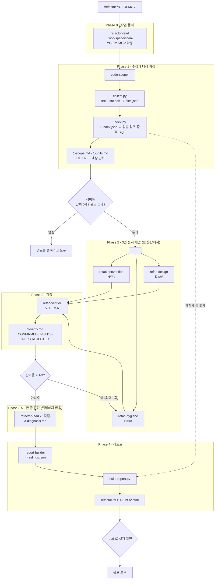

# 이 하네스는 어떻게 동작하는가

> `09-refactor-oi` — 기존 소스를 훑어 **리팩토링할 곳을 제안**하고,
> 팀이 "그래서 뭐부터 할까"를 정할 때 쓰는 **단일 HTML 파일**을 만듭니다.
> **코드는 고치지 않습니다.**

이 문서 하나면 됩니다. 발표 자료로 쓰거나 팀에 소개할 때 이것만 보여 주세요.

---

## 1. 한 장 요약

| | |
|---|---|
| **입력** | 소스 경로 하나 (`YOEDSMOV` · `src/Screens/YOEDSMOV` · 저장소 전체는 `.`) |
| **출력** | `_workspace/scan-<slug>/refactor-<slug>.html` — 브라우저로 그냥 여는 파일 |
| **관점** | 컨벤션 · 중복/미사용 · 구조 |
| **분류** | 개선 유형 8종 × 비용 3단 (**우선순위 없음**) |
| **등장인물** | 오케스트레이터 1 + 스코퍼 1 + 제안자 3 + 검증관 1 + 빌더 1 = **7** |
| **한 사이클** | 모델 호출 **7회** |
| **필요한 것** | Python 3.8+ 만. `gh` 불필요, git 은 선택 |
| **네트워크** | **0** — 리포트도 폐쇄망에서 열립니다 |

## 2. 왜 이렇게 만들었나

| 문제 | 이 하네스의 답 |
|---|---|
| "리팩토링 좀 하자" 는 말이 **아무 일도 일으키지 않는다** | **개선 유형 × 비용** 2축과 한눈에 보기 표로 **고를 수 있게** 만듭니다 |
| LLM 에게 "안 쓰는 코드를 찾아라" 하면 **반드시 놓친다** | 전수 조사는 `index.py` 가 합니다. 모델은 **판정만** |
| WPF 는 **참조를 숨긴다** — XAML·문자열·리플렉션 | 인덱서가 14가지 경로를 보고, 검증관이 `V-4` 로 한 번 더 막습니다 |
| 제안이 너무 많으면 **아무도 안 읽는다** | 규모 게이트 · 검증 반려 · 유형/비용 필터 |
| 하네스가 정해 준 **순서는 쓰이지 않는다** | 순서를 정해 주지 않습니다. 제안을 **한눈에 보기 표**로 늘어놓고 개발자가 고릅니다 |

## 3. 전체 흐름



| Phase | 담당 | 읽는 것 | 쓰는 것 |
|---|---|---|---|
| 0 | `refactor-lead` | — | `STATUS.md` |
| 1 | `code-scoper` | 대상 소스 | `src/` · `1-index.json` · `1-scope.md` · `1-units.md` |
| 2 | 제안자 3인 | `1-units.md` · `1-index.md` · `src/` · 자기 참조 문서 | `2-suggest-*.md` |
| 3 | `refac-verifier` | 위 전부 + `1-index.json` | `3-verify.md` |
| 3.5 | `refactor-lead` | `2-*` · `3-verify.md` | `3-diagnosis.md` |
| 4 | `report-builder` | 위 전부 | `4-findings.json` → **HTML** |

## 4. Phase 별로 무슨 일이 일어나나

### Phase 0 — 작업 폴더 확정

대상 경로에서 slug 를 만들어 `_workspace/scan-<slug>/` 로 정합니다.

| 대상 경로 | 작업 폴더 |
|---|---|
| `YOEDSMOV` | `scan-YOEDSMOV` |
| `src/Screens/YOEDSMOV` | `scan-src-Screens-YOEDSMOV` |
| `.` | `scan-root` |

폴더를 나누지 않으면 파일 이름이 전부 같아 서로를 덮어씁니다.
특히 `src/` 에 두 대상의 원문이 섞이면 **리포트에 엉뚱한 코드가 실립니다.**

오케스트레이터는 **폴더를 직접 만들지 않습니다.** `collect.py` 가 만듭니다.
**아무것도 지우지 않습니다** — `rm` 권한이 없습니다.

### Phase 1 — 수집 · 인덱싱 · 대상 확정

**여기가 08 과 가장 크게 갈리는 지점입니다.**

08 은 diff 가 "무엇을 볼지"를 공짜로 정해 줬습니다. 09 에는 그런 경계가 없습니다.

```bash
python …/collect.py --path YOEDSMOV --ws _workspace/scan-YOEDSMOV
python …/index.py  --ws _workspace/scan-YOEDSMOV
```

`collect.py` 가 하는 일:

- 텍스트 소스만 골라 `src/` 로 **바이트 그대로** 복사 (`bin/` · `obj/` · 생성 코드 제외)
- **코드가 부르는 mapper 만 골라** `src-sql/` 로 (아래)
- git 이 있으면 파일별 최종 수정일·커밋 수 (오래 안 건드린 코드의 약한 신호)
- 이전 실행은 **지우지 않고** `.prev-<시각>` 으로 밀어냄

mapper 선별이 필요한 이유는 규모입니다. DPI mapper 저장소는 전사 공용이라
dao 폴더 하나에 XML 이 수백 개 있고, 한 화면이 부르는 것은 서너 개입니다.

```
src/ 의 C# 에서 "lot.selectMcLot" 리터럴을 찾음
  → 네임스페이스 {lot}
  → 트리의 XML 앞 16KB 를 읽어 선언된 namespace= 를 전수로 확인
  → namespace 가 lot 인 파일을 **전부** 복사 (lot.xml · lotMapper.xml · …)
  → 선언을 못 읽은 파일만 이름으로 대조
```

**이름이 맞는 파일 하나를 찾았다고 멈추면 안 됩니다.** `dao/lot/` 아래에
`lot.xml` 과 `lotMapper.xml` 이 둘 다 `namespace="lot"` 인 것이 DPI 의 기본형이고,
`lot.countLot` 은 뒤쪽 파일에만 있습니다. 멈추면 그 SQL 이 통째로 사라지는데
네임스페이스는 찾았으니 **못 가져왔다는 표시조차 남지 않고**, 인덱서가 그 ID 를
「정의 없음 = 실행하면 터진다」로 회의 자료에 싣습니다.

**1MB 가 넘는 파일은 건너뛰지 않고 부르는 문장만 잘라 옵니다.** `lotMapper.xml`
하나에 SQL 이 수천 개인 것이 DPI 에서는 보통이라, 통째로 옮기면 작업 폴더가
부풀고 리뷰어가 읽을 것을 못 찾습니다. `<select id="…">` 의 id 로 골라 필요한
문장만 남기고, `<include refid>` 로 끌어 쓰는 `<sql>` 조각도 따라갑니다
(1.2MB → 1KB 정도로 줄어듭니다). 잘랐다는 사실은 파일 머리말과
`mapperFilesTrimmed` 양쪽에 남습니다 — **그 파일로는 「안 쓰는 SQL」을 판정할 수
없기 때문**입니다.

호출 방식도 여기서 가릅니다. 전부 `SendMessage*(<종류>, …)` 로 나가고
**첫 인자가 종류**입니다 — 맨몸 상수(`DPICALL`)일 때도 문자열(`"LOTCOMMENT"`)일
때도 있습니다. `DPICALL` 은 mapper 에서 찾고, `SQLEXEC` 는 화면이
`_sql` 에 조립한 SQL 이라 화면에서 읽고, **나머지는 전부 Rule 시스템 메시지라
저장소에 없어 아예 SQL ID 로 집지 않습니다.**

`SET_SIMAXDATA` 가 함정입니다 — 뒤에 붙는 `"legacy_semis.updateSemisDelivery"` 가
SQL ID 와 똑같이 생겼거든요. 안 가르면 멀쩡한 백엔드 호출이 「정의 없음 =
실행하면 터진다」로 회의 자료에 실립니다.

**화이트리스트로 가릅니다.** SQL 을 가진 종류만 적어 두고 나머지는 Rule 로
봅니다 — Rule 메시지 이름(`TKIN`·`TKOUT`·`ISSUE` …)은 계속 늘어 열거할 수
없어서, 새 메시지가 생겨도 저절로 맞는 쪽을 골랐습니다.
규칙은 `assets/calls.py` 한 곳에 있고 두 스크립트가 같이 씁니다 — 한쪽만
고치면 수집과 인덱싱이 어긋나 오탐이 납니다.

못 찾은 네임스페이스는 `1-meta.json` 의 `namespacesNotFound` 에,
잘라 온 파일은 `mapperFilesTrimmed` 에 남습니다.
인덱서도 「부르는데 정의가 안 보이는 ID」를 `missingIds`(본문을 **읽었는데** 없음)와
`unverifiedIds`(본문을 **못 읽음**)로 나눠 셉니다.
**"정의가 없다"(진짜 문제)와 "확인하지 못했다"(읽지 못함)를 섞지 않기 위해서**입니다.

`index.py` 가 하는 일 — **전수 조사**:

| 산출 | 어떻게 |
|---|---|
| `symbols[]` | C# 을 마스킹(주석·문자열 제거)한 뒤 중괄호 깊이로 심볼 경계를 잡습니다 |
| `refs` | 식별자 출현을 C# · XAML · 문자열 세 갈래로 나눠 셉니다 |
| `wpfHints` | **WPF 가 참조를 숨기는 14가지 경로** (아래 §5-②) |
| `unreferenced[]` | 참조 0 + 힌트 없음. **확신 3등급**을 함께 매깁니다 |
| `duplicateCandidates[]` | 정규화 토큰 5-gram 의 Jaccard ≥ 0.75, 8줄 이상 |
| `sql` | mapper 정의 ID ↔ C# 호출 ID 대조 → 정의없음·확인못함 (**본문은 참고 자료로만 싣습니다**) |

그다음 `code-scoper` 가 **무엇을 볼지 고릅니다.**
`symbols[]` 전부를 단위로 만들면 폭발하므로, **제안할 거리가 있을 만한 것만**
`U1` 부터 번호를 매깁니다.

```markdown
| ID | 파일 | 유형 | 줄 | 참조 | 요약 |
|---|---|---|---|---|---|
| U1 | YOEDSMOV.xaml.cs | 필드   | 26–26   | 0 | `MaxRowCount` — 선언만 있고 읽는 곳이 없습니다 |
| U5 | YOEDSMOV.xaml.cs | 메서드 | 150–213 | 1 | `Confirm()` — 선택 수집·검증·저장을 한 덩어리로 (64줄) |
```

### Phase 2 — 3인 동시 제안 (팬아웃)

오케스트레이터가 **한 응답에서 세 개의 `task`** 를 부릅니다.
나눠 부르면 직렬이 되어 느리고 비쌉니다.

세 프롬프트는 **산출물 파일명만 다릅니다.** 각자 읽을 참조 문서는 자기 프롬프트가 압니다.

| 제안자 | 참조 문서 | ID |
|---|---|---|
| `refac-convention` | `naming-rules.md` | `N###` |
| `refac-hygiene` | `hygiene-rules.md` | `H###` |
| `refac-design` | `design-rules.md` | `D###` |

**셋이 전부를 읽으면 컨텍스트가 3배로 낭비되고, 남의 영역까지 제안하기 시작합니다.**

### Phase 3 — 검증 (생성-검증)

제안 하나마다 여섯 검사를 겁니다.

| 검사 | 대조 대상 | 결과 |
|---|---|---|
| V-1 | `1-units.md` 표 | 범위 밖이면 `REJECTED` |
| V-2 | `src/` 원문 | 인용이 다르면 `REJECTED` |
| V-3 | 참조 문서 | 규칙이 없으면 `REJECTED` |
| **V-4** | **`1-index.json`** | **미참조 오탐이면 `REJECTED`** |
| V-5 | `duplicateCandidates` | 중복 후보가 아니면 `REJECTED` |
| V-6 | `영향` 칸 | 범위를 안 셌으면 `작음` → `보통` **상향** |

한 관점의 반려율이 **1/3 을 넘으면** 그 제안자의 **세션을 다시 열어** 고치게 합니다
(`task_id` 재사용 — 맥락이 남습니다). 고친 뒤엔 **새 검증관**을 돌립니다.
최대 2회.

### Phase 3.5 — 개선 로드맵 (오케스트레이터가 직접)

**위임하지 않습니다.** 세 관점을 전부 본 사람은 오케스트레이터뿐입니다.

제안자들은 각자 자기 것만 봅니다. **세 묶음을 한자리에 놓고 "무엇이 지금
가장 비싼가"를 한 문단으로 말할 수 있는 것**은 오케스트레이터뿐입니다.

```markdown
## 한 줄 진단         ← 증상이 아니라 원인. 3~5줄. 이것뿐입니다
```

**순서는 정해 주지 않습니다.** 예전에는 「손대는 순서」·「묶어서 하면 좋은
것」·「지금은 두는 게 낫습니다」까지 썼는데, 실제로는 **개발자가 보고 스스로
골라서** 고칩니다. 하네스가 짠 계획은 쓰이지 않습니다.

대신 리포트가 제안 전체를 **「개선 제안 한눈에 보기」 표**로 늘어놓습니다.

| ID | 개선 유형 | 비용 | 단위 | 무엇이 바뀌나 |
|---|---|---|---|---|
| H001 | 삭제 | 작음 | U1 | `MaxRowCount` 는 선언만 있고 읽는 곳이 없다 |
| D001 | 함수 추출 | 큼 | U5 | `Confirm()` 하나가 수집·검증·저장·메시지 조립을 모두 한다 |

이 표는 **`findings` 에서 스크립트가 만듭니다.** 그래서 본문과 절대 어긋나지
않고, 필터를 걸면 표도 같이 줄어듭니다. 행을 누르면 그 카드로 내려갑니다.
**오케스트레이터가 쓸 것이 없습니다.**

확인 못 한 것(mapper 미수집 · `unverifiedIds` · 빈 관점)은 「확인 못 한 것」
절(`unknowns`)로 갑니다.

### Phase 4 — 리포트

`report-builder` 가 만드는 것은 `4-findings.json` **하나**입니다.
HTML 은 `build-report.py` 가 만듭니다.

```
src/…           ─┐
1-index.json    ─┼→ build-report.py → HTML
4-findings.json ─┘   (제안 내용 + 좌표만)
```

스크립트가 **스키마를 검증**하고, 어긋나면 무엇이 틀렸는지 출력하며 exit 1 합니다.

```
✗ findings.json 검증 실패 — 2건
  · findings[3] (H004): unitId "U99" 가 units 에 없습니다
  · findings[7] (D002): "effort" 는 작음 | 보통 | 큼 중 하나여야 합니다 (받은 값: 중간)
```

---

## 5. 설계 결정 일곱 가지

### ① 기계가 먼저 세고, 모델은 판정만 한다

"이 코드는 아무도 안 씁니다" 는 **전수 조사로만** 할 수 있는 말입니다.
LLM 에게 `grep` 을 시키면 반드시 몇 개를 놓칩니다.

그래서 인덱서가 먼저 세고, 제안자는 **후보에 맥락을 붙이는 일**만 합니다.

리포트에도 그 구분이 남습니다 — 「기계가 센 것」 절에
**"모델이 쓴 숫자가 아닙니다"** 라고 적혀 있습니다.

### ② WPF 가 참조를 숨기는 14가지 경로

이 하네스가 가장 크게 틀릴 수 있는 자리입니다.

```csharp
private void btnSearch_Click(object sender, RoutedEventArgs e)  // C# 호출부: 0곳
```
```xml
<Button Click="btnSearch_Click" />                              <!-- 여기서 부릅니다 -->
```

| 경로 | 무엇을 스캔하나 |
|---|---|
| 이벤트 핸들러 | `Click=` · `Loaded=` 등 이벤트 속성, `EventSetter Handler=` |
| `x:Name` | XAML 선언 ↔ C# 의 같은 이름 |
| 데이터 바인딩 | `{Binding Foo}` · `{Binding Path=Foo.Bar}` 의 첫 세그먼트 |
| 명령 | `Command="{Binding SaveCommand}"` |
| 리소스 키 | `x:Key` ↔ `{StaticResource}` · `{DynamicResource}` |
| 컨버터 | `IValueConverter` 구현이 `x:Key` 로 등록됨 |
| 의존 속성 | `FooProperty` ↔ `Foo` ↔ XAML 속성 |
| 속성 변경 알림 | `OnPropertyChanged("Foo")` — **문자열** |
| 타입 참조 | `{x:Type local:Bar}` · `TargetType` · `DataType` · `x:Class` |
| 인터페이스 계약 | `I` 로 시작하는 기반 타입의 public 멤버 |
| 리플렉션 | `GetMethod("Foo")` · `GetProperty` |
| 이벤트 구독 | `foo.Bar += Baz;` |
| resx | `.resx` 키 |
| SQL ID | `DPICALL("lot.selectMcLot")` ↔ mapper `<select id=…>` |

**하나라도 빠지면 그 종류의 코드가 전부 "죽었다"고 나옵니다.**

여기서 한 가지를 배웠습니다 — 초기 버전은 `Height="Auto"` 의 `Auto` 같은
**열거형 값까지 핸들러로 셌습니다.** 그래서 맨몸 식별자는 **메서드 이름과
맞아떨어질 때만** 참조로 인정하도록 좁혔습니다.

### ③ 확신 등급을 감추지 않는다

인덱서는 단정하지 않습니다.

| 확신 | 언제 | 제안에 이렇게 적습니다 |
|---|---|---|
| **높음** | `private`/`internal`, WPF 경로 어디에도 안 걸림 | "지워도 컴파일과 동작이 그대로입니다" |
| **중간** | `public`/`protected` — 대상 경로 밖에서 쓸 수 있음 | "저장소 전체에서 찾아본 뒤 지우세요" |
| **낮음** | 상속·특성·리플렉션이 얽힘 | "사람이 확인해야 합니다" |

`중간` 은 **"지우세요"가 아니라 "확인하고 지우세요"** 로 씁니다.
이 하네스는 대상 경로만 봤으니, 그 이상을 말하면 거짓말이 됩니다.

### ④ 부탁이던 두 줄이 장치가 됐다

> XAML 에서만 쓰이는 코드를 죽은 코드로 오인하지 않는다.
> 대상 경로 밖의 사용을 단정하지 않는다.

문장만 있으면 모델은 급할 때 무시합니다. 그래서 세 곳에 걸었습니다.

1. **인덱서** — `wpfHints` 가 있으면 `unreferenced[]` 에 **아예 올리지 않습니다**
2. **제안자 프롬프트** — "인덱스에 없는 것을 미참조라고 말하지 마세요"
3. **검증관의 `V-4`** — 그래도 말하면 `REJECTED`

3번이 핵심입니다. **지키라고 부탁하는 대신 안 지키면 걸러냅니다.**

### ⑤ 두 축이 "무엇을 고를지"를 돕는다

**우선순위를 두지 않습니다.** 순서는 개발자가 정하기 때문입니다.
대신 두 축으로 **고르기 쉽게** 만듭니다.

| 축 | 무엇을 말하나 | 값 |
|---|---|---|
| **개선 유형** | 무엇을 바꾸는 변경인가 | 이름 변경 · 삭제 · 중복 통합 · 함수 추출 · 흐름 정리 · 호출 방식 · 상수화 · SqlManager 이관 |
| **비용** | 얼마나 퍼지나 | 작음 · 보통 · 큼 |

```
"이번엔 이름만 몰아서"   → [이름 변경] 칩
"30분이면 되는 것만"     → [지금 바로 할 수 있는 것] 칩 (비용 작음)
"죽은 코드부터 치우자"   → [삭제] + [비용 작음]
```

유형에는 **경중이 없습니다.** 그래서 칩 색에 강약을 두지 않고 일곱을
구분만 하고, 제안 카드의 좌측 색 띠도 없앴습니다.

### ⑥ 순서를 정해 주지 않는다

하네스가 짠 계획은 쓰이지 않습니다. **개발자가 보고 스스로 고릅니다.**

그래서 「손대는 순서」·「묶어서 하면 좋은 것」·「지금은 두는 게 낫습니다」를
전부 뺐습니다. 남은 것은 **한 줄 진단**과, 제안 전체를 한 줄씩 늘어놓은
**한눈에 보기 표**입니다. 표는 `findings` 에서 스크립트가 만들어
본문과 어긋날 수 없고, 오케스트레이터가 쓸 것도 없습니다.

### ⑦ 모델 없이 하네스를 점검할 수 있다

`ws.py --selftest` 가 수집 → 인덱싱 → 리포트 렌더를 샘플로 돌리고,
심어 둔 결함이 잡히는지와 **WPF 함정이 걸러지는지**를 확인합니다.

```
3. 죽은 코드를 잡았나
  ✓ `MaxRowCount` 가 미참조(확신 높음)로 잡혔습니다
  ✓ `SearchLotByLine` 가 미참조(확신 높음)로 잡혔습니다

4. WPF 함정을 피했나  ← 이 하네스의 핵심
  ✓ `btnSearch_Click` 를 죽은 코드로 오인하지 않았습니다
  ✓ `LotStatusConverter` 를 죽은 코드로 오인하지 않았습니다
```

**토큰이 한 푼도 들지 않습니다.** 복사해 간 저장소에서도 그대로 돕니다.

---

## 6. 무엇이 남나

```
_workspace/scan-YOEDSMOV/
├── STATUS.md                 진행판
├── 1-meta.json               대상·규모·mapper 수집 결과
├── 1-files.json              파일별 종류·줄 수·최종 수정일
├── src/…                     대상 소스 원문
├── src-sql/…                 이 코드가 부르는 mapper 만
├── 1-index.json              ★ 기계가 센 것 — 검증관이 대조하는 사실
├── 1-index.md                위의 사람이 읽는 요약
├── 1-scope.md                이 코드가 하는 일
├── 1-units.md                대상 단위 표 (U1, U2 …)
├── 2-suggest-convention.md
├── 2-suggest-hygiene.md
├── 2-suggest-design.md
├── 2-suggest-sql.md
├── 3-verify.md               V-1~V-6 판정
├── 3-diagnosis.md            한 줄 진단
├── 4-findings.json           HTML 입력
└── refactor-YOEDSMOV.html    ★ 회의에서 여는 파일
```

**아무도 지우지 않습니다.** 같은 대상을 새로 돌리면 `.prev-<시각>` 으로 밀어냅니다.
정리는 사람이 합니다.

## 7. HTML 리포트 — 회의에서 하는 일

**요약이 먼저, 코드는 나중입니다.**

| 순서 | 무엇 |
|---|---|
| 1 | **이 코드가 하는 일** |
| 2 | **한 줄 진단** + **개선 제안 한눈에 보기** (표는 findings 에서 자동 생성) |
| 3 | **기계가 센 것** — 모델이 쓴 숫자가 아님을 명시 |
| 4 | **대상 요약** — 단위별 "무엇인가" + 제안 건수 |
| 5 | 파일 → 단위 → 제안 카드 (코드는 기본으로 접힘) |

| 기능 | 쓰임 |
|---|---|
| **한눈에 보기 표** | 제안 전체를 한 줄씩. `findings` 에서 자동 생성 |
| **`지금 바로 할 수 있는 것` 칩** | 비용 `작음` 만 남깁니다 |
| 3종 필터 (우선순위·비용·관점) | 겹쳐 걸 수 있습니다 |
| **C# · XAML · SQL 하이라이트** | 외부 라이브러리 없이 내장 |
| **[하기로] [보류] [안 함]** + 메모 | `localStorage`, 키 = `oi-refactor-<slug>` |
| 마크다운 / JSON 내보내기 | 회의 결과를 그대로 |
| 인쇄 | 전부 펼쳐진 상태로. **화면이 다크여도 종이는 밝게** |
| **외부 요청 0** | 폐쇄망에서 그냥 열립니다 |

## 8. 처음 쓰는 사람을 위한 순서

### 준비물

| | |
|---|---|
| **Python 3.8+** | `python --version`. **pip 설치 불필요** |
| OpenCode | 프로바이더 인증이 되어 있어야 합니다 |
| git | **선택** |

`gh` 는 필요 없습니다.

### ① 모델 없이 — 스크립트가 도는지

```bash
cd 09-refactor-oi
python .opencode/skills/refactor-oi-scan/assets/ws.py --doctor
python .opencode/skills/refactor-oi-scan/assets/ws.py --selftest
```

**토큰이 들지 않습니다.** 여기서 통과하면 파이프라인은 살아 있는 것입니다.

### ② 오프라인 데모 — 에이전트까지

```bash
opencode run "/refactor-sample"
```

`_workspace/scan-sample/refactor-sample.html` 이 나옵니다.
샘플에는 세 관점 결함과 **WPF 오탐 함정**이 함께 심어져 있으니,
맨 아래 **반려된 제안**을 펴서 `V-4` 가 무엇을 잡았는지 보세요.

### ③ 실제 코드는 Phase 1 부터

```bash
opencode run "/scan-only YOEDSMOV"
```

대상 단위가 맞는지 먼저 봅니다. **여기가 틀리면 뒤가 전부 틀어집니다.**

### ④ 전체 사이클

```bash
opencode run "/refactor YOEDSMOV"
```

### 커맨드 여섯 개

| 커맨드 | 무엇 |
|---|---|
| `/refactor <경로>` | 전체 사이클 |
| `/scan-only <경로>` | Phase 1 만 |
| `/report-only <경로>` | HTML 만 재생성 |
| `/refactor-sample` | 오프라인 데모 |
| `/status` | 진행 중인 모든 분석 |
| `/doctor` | 설치·환경 점검 |

### ⑤ 우리 저장소로 옮기기

`.opencode/` 와 `opencode.jsonc` 를 **저장소 루트에** 복사합니다.
그다음 `mapper-dir.txt` 에 팀의 mapper 경로를 넣고 `/doctor` 를 돌리세요.

`opencode.jsonc` 를 빠뜨리면 **`subagent_depth: 1` 이 사라져 3인 동시 제안이 막힙니다.**

## 9. 막히면

| 증상 | 원인 | 어떻게 |
|---|---|---|
| 제안이 하나도 안 나온다 | 대상 단위가 0개 | `/scan-only` 로 `1-units.md` 를 확인. 경로를 넓히세요 |
| 제안이 200건 나온다 | 대상이 너무 넓음 | 화면 하나로 좁히세요. 규모 게이트가 원래 막습니다 |
| 멀쩡한 코드가 "안 쓰인다"고 나온다 | 인덱서가 못 본 참조 경로 | `1-index.json` 의 `wpfHints` 를 보세요. 새 경로면 `index.py` 에 추가할 자리입니다 |
| SQL 미사용 판정이 없다 | mapper 를 못 가져옴 | `1-meta.json` 의 `mapperNote`. `mapper-dir.txt` 에 매핑을 추가하세요 |
| mapper 를 0개 가져왔다 | 네임스페이스에 맞는 파일이 없음 | `1-meta.json` 의 `namespacesNeeded` 와 mapper 폴더 파일명을 대조. 파일명과 `namespace=` 가 둘 다 다르면 못 찾습니다 |
| SQL 몇 개만 "정의 없음"으로 나온다 | 그 네임스페이스가 **여러 파일에 나뉘어** 있는데 일부만 가져옴 | `src-sql/` 에 그 네임스페이스 파일이 몇 개 왔는지 보세요. 수집기는 `namespace=` 를 전수로 보고 전부 가져옵니다 — 그래도 빠지면 `mapperFilesUnread` 를 확인 |
| "정의 없음"인데 실제로는 잘 돈다 | 본문을 못 읽은 것을 없는 것으로 본 것 | `1-index.json` 의 `unverifiedIds` 에 있으면 **확인 못 한 것**입니다. `missingIds` 에 있어야 진짜 문제입니다 |
| Rule 메시지가 "정의 없음"으로 나온다 | `SET_SIMAXDATA` 를 SQL ID 로 센 것 | 저장소에 없는 것이 정상입니다. `sql.ruleMessages` 로 빠져야 합니다 — 호출 이름이 팀마다 다르면 `collect.py` 의 `CALL_RULE` 을 고치세요 |
| 1MB 넘는 mapper 의 SQL 을 못 읽는다 | — | 이제 건너뛰지 않고 **부르는 문장만 잘라** 옵니다. `mapperFilesTrimmed` 에 남습니다. 다만 그 파일로는 `Q-5`(안 쓰는 SQL)를 판정하지 않습니다 |
| 제안자 하나가 빈 결과를 돌려준다 | 산출물 파일을 안 쓰고 끝냄 | 파일 유무로 판정합니다. 한 번만 다시 부르고, 그래도 비면 **그 관점 없이** 진행하고 리포트에 그 사실을 적습니다 |
| 작업 폴더가 너무 크다 | `--all-mappers` 를 줬음 | 선별이 기본입니다. 그 옵션을 빼세요 |
| 리포트에 코드가 안 보인다 | `sourceFile` 경로 어긋남 | mapper 는 `src-sql/…` 로 적어야 합니다 |
| 3인 동시 호출이 안 된다 | `opencode.jsonc` 누락 | 저장소 **루트**에 두세요 |
| 스크립트가 파일을 못 읽는다 | PowerShell 5.1 의 `>` 가 UTF-16LE 로 씀 | 스크립트가 감지해 경고합니다. `collect.py` 를 쓰면 안 생깁니다 |

## 10. 치트시트

```bash
# 점검 (토큰 0)
python .opencode/skills/refactor-oi-scan/assets/ws.py --doctor
python .opencode/skills/refactor-oi-scan/assets/ws.py --selftest
python .opencode/skills/refactor-oi-scan/assets/ws.py --list

# 스크립트 단독
S=.opencode/skills/refactor-oi-scan
python $S/assets/collect.py --path YOEDSMOV --ws _workspace/scan-YOEDSMOV
#   기본은 선별 수집입니다. 트리 전체가 필요하면 --all-mappers
python $S/assets/index.py --ws _workspace/scan-YOEDSMOV
python $S/assets/build-report.py _workspace/scan-YOEDSMOV/4-findings.json \
                                 _workspace/scan-YOEDSMOV/refactor-YOEDSMOV.html

# 커맨드
opencode run "/doctor"
opencode run "/refactor-sample"
opencode run "/scan-only YOEDSMOV"
opencode run "/refactor YOEDSMOV"
opencode run "/report-only YOEDSMOV"
opencode run "/status"
```

| 어휘 | 값 |
|---|---|
| 개선 유형 | `이름 변경` · `삭제` · `중복 통합` · `함수 추출` · `흐름 정리` · `호출 방식` · `상수화` · `SqlManager 이관` |
| 비용 | `작음` · `보통` · `큼` |
| 관점 | `convention` · `hygiene` · `design` · `sql` |
| 단위 유형 | `클래스` · `메서드` · `프로퍼티` · `필드` · `이벤트 핸들러` · `XAML` · `SQL` |
| 판정 | `CONFIRMED` · `NEEDS-INFO` · `REJECTED` |
| 확신 | `높음` · `중간` · `낮음` |

## 더 읽을 것

- [README.md](../README.md) — 실행법, 패턴이 보이는 지점 ①~⑪, 파일 구조
- [../08-code-review-oi/docs/how-it-works.md](../../08-code-review-oi/docs/how-it-works.md) — PR 코드리뷰 하네스
- [SKILL.md](../.opencode/skills/refactor-oi-scan/SKILL.md) — 스킬 진입점
